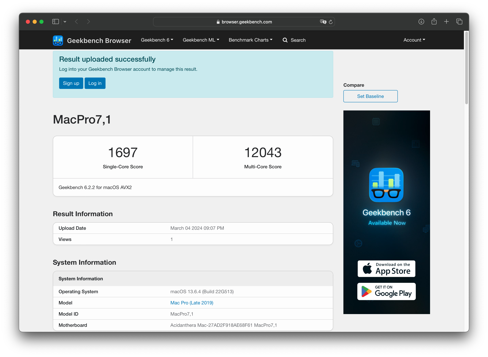
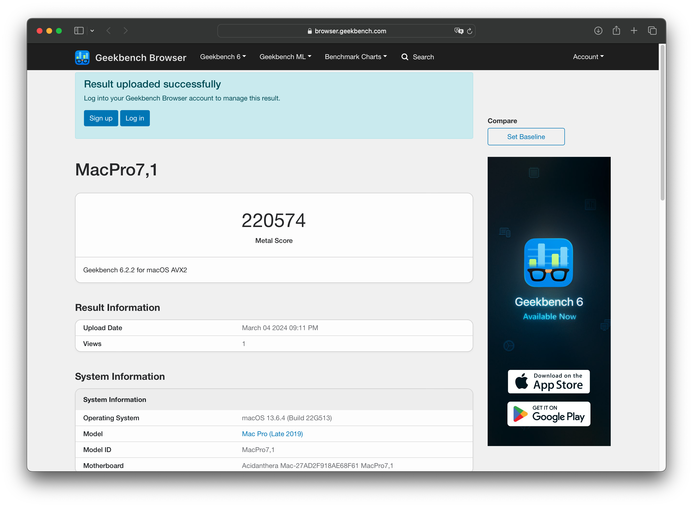
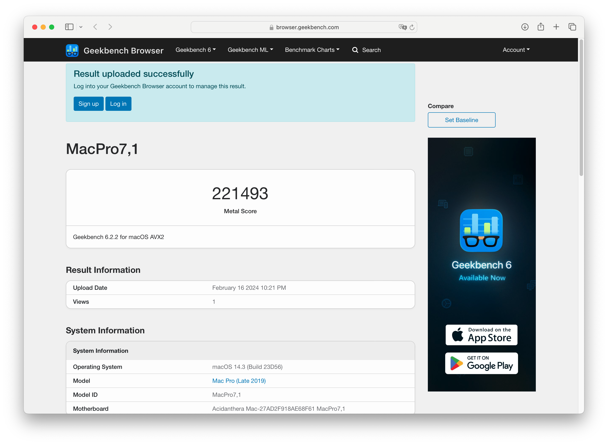
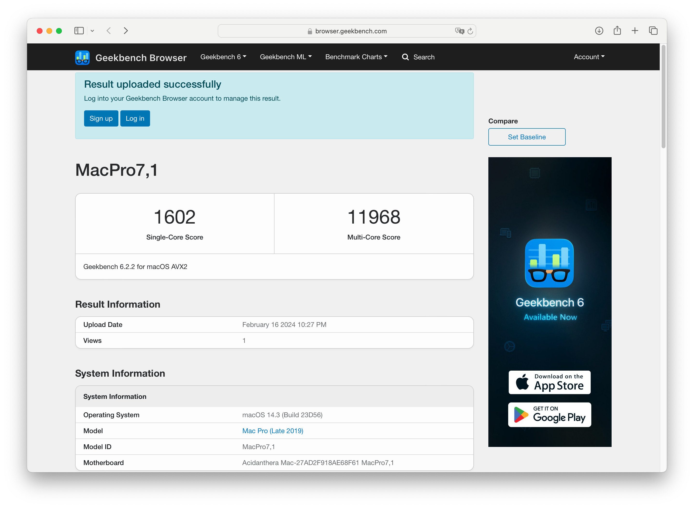
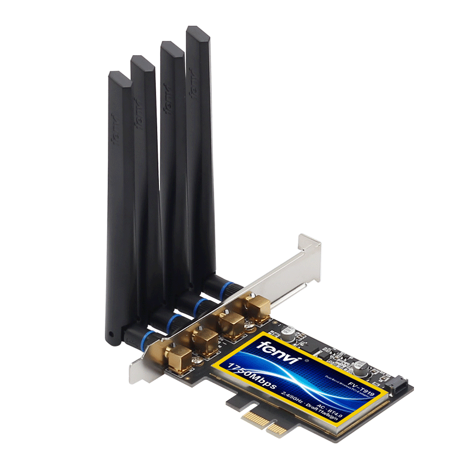

# Ryzentosh — Gigabyte X570 AORUS ELITE (Ryzen 9 5900X) — macOS Big Sur → Sonoma

  

---

## 📌 Qué contiene este repositorio
Este repositorio contiene el **directorio EFI** para el combo:
- **CPU:** AMD **Ryzen 9 5900X** (PBO activado)
- **Motherboard:** **Gigabyte X570 AORUS ELITE** (BIOS **F38H**)

> Úsalo como **referencia**. Adáptalo a tu hardware exacto y genera tus seriales.

---

## ✅ Compatibilidad
- **macOS:** Big Sur / Monterey / Ventura / Sonoma
- **OpenCore:** **0.9.9**

---

## 🖥️ Capturas

### macOS 13 Ventura

### Rendimiento — Geekbench 6 (Ventura)

---

### macOS 14 Sonoma

### Rendimiento — Geekbench 6 (Sonoma)

---

### macOS 14.4.1 Sonoma

### Rendimiento — Geekbench 6 (Sonoma 14.4.1)

---

## 📡 Wi-Fi / Bluetooth
### Fenvi T919

---

## 🧩 Especificaciones

| Componente   | Producto | Notas |
|--------------|----------|------|
| CPU          | AMD Ryzen 9 5900X | PBO activado |
| Motherboard  | Gigabyte X570 Aorus Elite | BIOS F38H |
| Memoria RAM  | 32GB DDR4 3200MHz | Overclock a 3200MHz |
| Gráficos     | AMD Radeon RX 6900XT 16GB | — |
| Disco        | NVMe XPG Atom 50 1TB PCIe Gen4 | — |
| Ethernet     | Intel® GbE LAN | — |
| BT/Wi-Fi     | Fenvi T919 (BCM94360CD) | — |

---

## ⚙️ Configuración del BIOS (recomendada)

- Enter BIOS → **Delete** → Enter Setup
- **Exit** → Load Optimised Defaults
- **Ai Tweaker** → Ai Overclock Tuner → **D.O.C.P.**
- **Advanced** → APM Configuration → Power On By PCIe → **Disabled**
- **Advanced** → PCI Subsystem Settings → Above 4G Decoding → **Enabled**
- **Advanced** → PCI Subsystem Settings → Re-Size BAR Support → **Auto**
- **Advanced** → USB Configuration → Legacy USB Support → **Auto** (o **Disabled** si no lo necesitas)
- **Boot** → Boot Configuration → Fast Boot → **Disabled**
- **Boot** → CSM → Launch CSM → **Disabled**
- **Boot** → Secure Boot → OS Type → **Windows UEFI mode**
- **Boot** → Secure Boot → Key Management → Clear Secure Boot Keys

---

## 🛒 Dónde comprar
- **Motherboard:** Gigabyte X570 Aorus Elite — [Comprar aquí](https://amzn.to/30KCO2k "Gigabyte X570 Aorus Elite")
- **Procesador:** Ryzen 9 5900X — [Comprar aquí](https://amzn.to/49SNh9y "Ryzen 9 5900X")
- **RAM:** 32GB Corsair Vengeance RGB Pro (2x16) DDR4 3600 — [Comprar aquí](https://amzn.to/3JPyWiu "Corsair Vengeance RGB Pro DDR4 3600")
- **BT/Wi-Fi:** Fenvi T919 BCM94360CD — [Comprar aquí](https://amzn.to/3w3fkBX "Fenvi T919 BCM94360CD")

---

## ⚠️ Recomendación / Antes de usar
- Usa este EFI como **referencia**.
- Este `config.plist` puede incluir kexts/ajustes **no esenciales**. Revisa y elimina lo que no aplique a tu setup.
- **Genera seriales nuevos** (no uses seriales de terceros). Para referencia, consulta la guía de Dortania.  
  SMBIOS recomendado para este tipo de setup: **MacPro7,1**.

---

## 🧠 AMD Patches: Core Count (obligatorio verificar)
En los parches AMD recientes, debes ajustar el recuento de núcleos físicos en los parches:
`algrey - Force cpuid_cores_per_package`

> Importante: usa **núcleos físicos**, no threads.

### Replace / New Value (referencia)
| macOS Version | Replace Value | New Value |
|---|---|---|
| 10.13.x, 10.14.x | `B8000000 0000` | `B8 <CoreCount> 0000 0000` |
| 10.15.x, 11.x | `BA000000 0000` | `BA <CoreCount> 0000 0000` |
| 12.x, 13.0–13.2.1 | `BA000000 0090` | `BA <CoreCount> 0000 0090` |
| 13.3+ | `BA000000 00` | `BA <CoreCount> 0000 00` |

### Core Count → Hex
| Núcleos físicos | Hex |
|---:|:---:|
| 4  | `04` |
| 6  | `06` |
| 8  | `08` |
| 12 | `0C` |
| 16 | `10` |
| 24 | `18` |
| 32 | `20` |

Más información (autor):  
https://github.com/AMD-OSX/AMD_Vanilla#instructions

---

## 🧱 Estructura EFI

### ACPI
- SSDT-EC.aml
- SSDT-HPET.aml
- SSDT-PLUG.aml
- SSDT-PMC.aml
- SSDT-USBX.aml
- SSDT-SBUS-MCHC.aml

### Drivers
- HfsPlus.efi
- OpenCanopy.efi
- OpenRuntime.efi
- ResetNvramEntry.efi
- ToggleSipEntry.efi

### Kexts
- AMDRyzenCPUPowerManagement.kext
- AppleALC.kext
- AppleIGB.kext
- AppleMCEReporterDisabler.kext
- Innie.kext
- Lilu.kext
- NVMeFix.kext
- RadeonSensor.kext
- RestrictEvents.kext
- SMCAMDProcessor.kext
- SMCRadeonGPU.kext
- USBToolBox.kext
- UTBMap.kext
- VirtualSMC.kext
- WhateverGreen.kext

### Tools
- OpenShell.efi
- ResetSystem.efi

---

## ✅ Qué funciona
- Casi todo, incluyendo actualizaciones de Apple y continuidad (**Handoff, iMessage, AirDrop, FaceTime**, etc.)

---

## 📚 Referencias
- OpenCore Install Guide (Dortania): https://dortania.github.io/OpenCore-Install-Guide/
- Blog ReinierTutoriales: https://www.reiniertutoriales.com/
